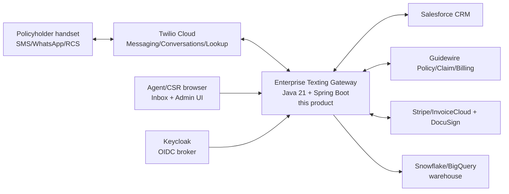
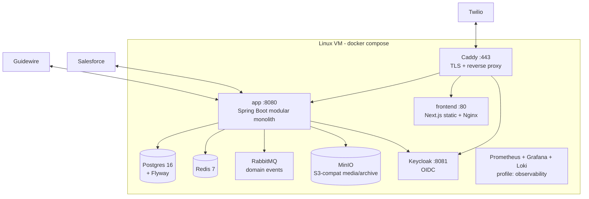
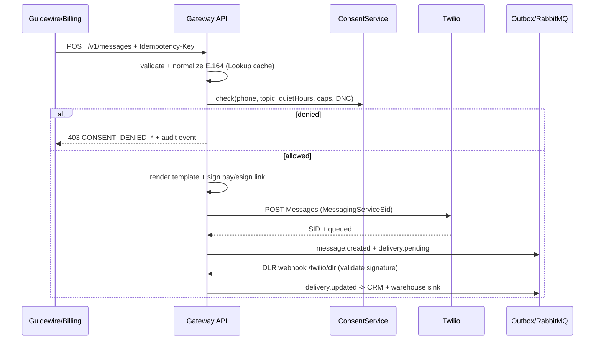
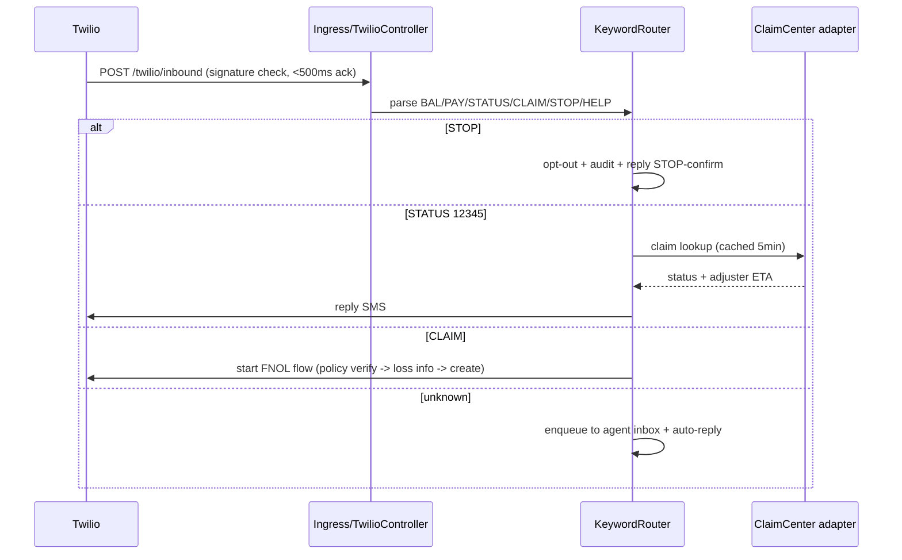
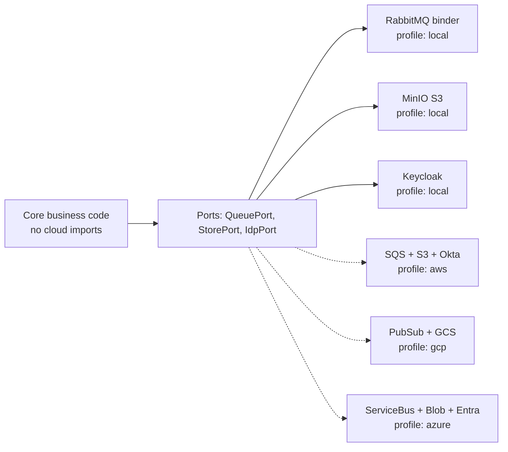

# Design Decisions (ADRs) — Enterprise Texting Gateway
**Date:** 2026-09-09 | **Status:** Accepted for v1 | **Deploys:** Linux VM + Docker Compose (1 install/customer, connected on-prem), portable to AWS/GCP/Azure

Locked context: Java-first team, SMS/MMS + WhatsApp/RCS via Twilio, workflows = servicing/renewals + billing + claims/FNOL + agent 1:1 + marketing, integrations = Salesforce + Guidewire + warehouse.

## ADR-001: Java 21 + Spring Boot 3.3 (over Rust / .NET / Node)
- **Decision:** Java 21 LTS, Spring Boot 3.3, Virtual Threads, Maven, Jib/distroless images.
- **Why:** team is Java-comfortable; official Twilio Java SDK; mature SOAP/REST for Guidewire/Salesforce; LTS + hiring pool; Virtual Threads give Rust-class throughput for webhook/DLR fan-out without reactive complexity.
- **Rejected:** Rust (no official Twilio SDK, slower enterprise integration), .NET (good for Guidewire but team preference Java), Node (weaker transactional guarantees for consent/audit).
- **Consequence:** larger images than Rust (~180MB vs ~20MB) — acceptable on VM; enforce `cargo-like` hygiene via `mvn enforcer + OWASP check`.

## ADR-002: Single-JVM modular monolith first (over microservices)
- **Decision:** One Spring Boot app, strict package modules (`consent`, `messaging`, `inbox`, `journey`, `hub.*`), Postgres schemas per module. Split to services only if CAT scale demands it.
- **Why:** single VM v1, one install/customer — ops simplicity, single Flyway chain, single backup. Virtual Threads handle concurrency.
- **Consequence:** module boundaries enforced by ArchUnit tests; outbox table preserves future service split.

## ADR-003: Postgres 16 + Redis 7 + RabbitMQ (over Kafka / cloud-native queues)
- **Decision:** Postgres (source of truth + outbox), Redis (idempotency/SLA/rate-limit), RabbitMQ (domain events) in Compose. Cloud queues behind Spring Cloud Stream binder abstraction.
- **Why:** all run in Docker on one VM; no Kafka ops burden; swap binder to SQS/PubSub/Service Bus in cloud with zero business-logic change.
- **Consequence:** cap steady throughput at ~5k msg/min on VM; document migration to managed Kafka/Redpanda if burst >100 MPS sustained.

## ADR-004: S3-compatible storage + MinIO locally
- **Decision:** code against S3 API only (`software.amazon.awssdk:s3`). Compose runs MinIO; cloud uses S3/GCS/Azure Blob (via S3 gateway or adapter).
- **Why:** MMS media + 7y archive must be portable; MinIO gives WORM/object-lock semantics locally.

## ADR-005: Keycloak bundled (over direct Okta/Entra)
- **Decision:** Keycloak 24 in Compose as OIDC broker. App trusts Keycloak issuer only. In cloud, Keycloak federates to Okta/Entra or is removed and issuer URL repointed.
- **Why:** works offline-ish/on-prem with no SaaS IdP dependency; same `spring-boot-starter-oauth2-resource-server` path everywhere.

## ADR-006: Docker Compose on Linux VM (over k3s/K8s in v1)
- **Decision:** Compose profile `app, db, redis, rabbitmq, minio, keycloak, frontend, observability`. Helm chart deferred to Phase 2 but images are Helm-ready (12-factor env, no host mounts except volumes).
- **Why:** lowest ops for single-customer VM; `install.sh` + `backup.sh` sufficient. K8s would add ops without scale need.

## ADR-007: Twilio as delivery plane, custom consent gate
- **Decision:** Twilio Messaging Services + Conversations + Lookup + Content API. Every send passes local `ConsentService` BEFORE Twilio call. Twilio Advanced Opt-Out enabled as second line, not primary.
- **Why:** TCPA proof + quiet-hours + caps are product IP; must survive carrier/Twilio retry duplication via `Idempotency-Key` + `messages.idempotency_key UNIQUE`.

## ADR-008: Next.js static frontend (over Vaadin/Thymeleaf-fullstack)
- **Decision:** React + Next.js static export + Nginx container for Agent Inbox + Admin + Preference Center. Backend is pure REST + OpenAPI.
- **Why:** richer inbox UX (realtime via SSE/WebSocket), portable static asset, Java team not blocked on JS build (separate `frontend/`).

---

## Diagrams

### C4 Context

### Container (VM Compose)

### Outbound send sequence (consent-gated, idempotent)

### Inbound keyword sequence

### Cloud-portability adapter boundary

Only `application-*.yml` + binder starter changes per cloud; `CORE` untouched.
